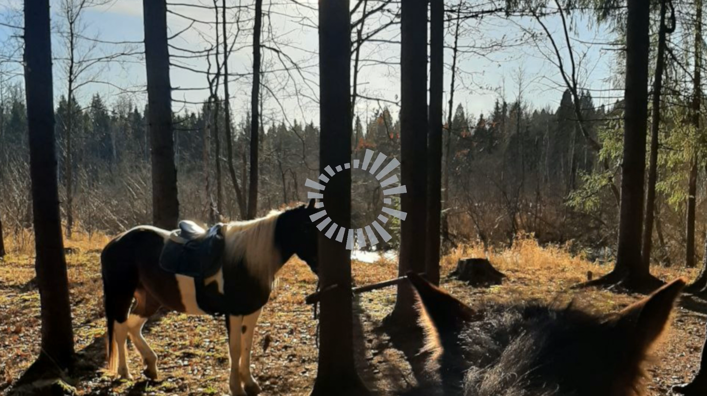

# nodejs-audio-visualizer
Audio visualizer generator for Node.js with simple configuration.  
Supports PNG, JPG for images and MP3, WAV for audio.

## Example
```javascript
const renderAudioVisualizer = require('nodejs-audio-visualizer').renderAudioVisualizer;
const config = {
  image: {
    path: 'media/background.png' // Supports PNG and JPG images
  },
  audio: {
    path: 'media/audio.wav' // Supports MP3 and WAV audio
  },
  outVideo: {
    path: 'media/out.mp4',
    fps: 25, // Default value: 30
    spectrum: { // Audio spectrum configuration (linear bar visualizer). Optional. If neither 'spectrum' nor 'polar' is specified, 'polar' is used by default.
      width: '30%', // 30% of background image width. Default value: 33%. Also you can use absolute values. For example, value 300 for 300 pixels width.
      height: '15%', // 15% of background image height. Default value: 160. Also you can use absolute values. For example, value 300 for 300 pixels height.
      x: 'center', // Available values: 'left', 'center', right'. Also you can use absolute number values. For example, value 300 for 300 pixels x.
      y: 'bottom', // Available values: 'top', 'middle', bottom'. Also you can use absolute number values. For example, value 300 for 300 pixels y.
      rotation: 'mirror', // Available values: 'up', 'down', 'mirror'. Default value: 'mirror'.
      effect: 'volume', // Available values: 'volume', 'smooth', undefined. Default value: undefined.
      color: '#cccc99', // Default value: inverted color of background image
      opacity: '70%' // Default value: '80%'.
    },
    polar: { // Polar/circular audio spectrum configuration (DEFAULT). Optional. Use either 'spectrum' or 'polar', not both.
      x: 'center', // Available values: 'left', 'center', 'right'. Also you can use absolute number values. Default value: 'center'.
      y: 'middle', // Available values: 'top', 'middle', 'bottom'. Also you can use absolute number values. Default value: 'middle'.
      innerRadius: 100, // Inner radius of the circular spectrum in pixels. Default value: 100.
      maxBarLength: 160, // Maximum bar length in pixels. Default value: 160.
      barWidth: 15, // Width of each bar in pixels. Default value: 15.
      effect: 'volume', // Available values: 'volume', 'smooth', undefined. Default value: undefined.
      color: '#cccc99', // Default value: inverted color of background image
      opacity: '70%' // Default value: '80%'.
    }
  },
  tweaks: { // Optional
    ffmpeg_cfr: '30', // Default value: 23
    ffmpeg_preset: 'ultrafast', // Default value: medium
    frame_processing_delay: 1000 // Delay between processing frames in milliseconds
  }
};

const onProgress = (progressPercent: number) => { // not necessary callback
  console.log(`progress: ${progressPercent} %`);
};

let counter = 0;
const shouldStop = () => { // not necessary callback
  if (counter > 5) {
    return true;
  }
  counter++;
  return false;
};

renderAudioVisualizer(config, onProgress, shouldStop)
  .then((exitCode) => {
    console.log(`exited with code: ${exitCode}`);
  });
```

## Output preview

