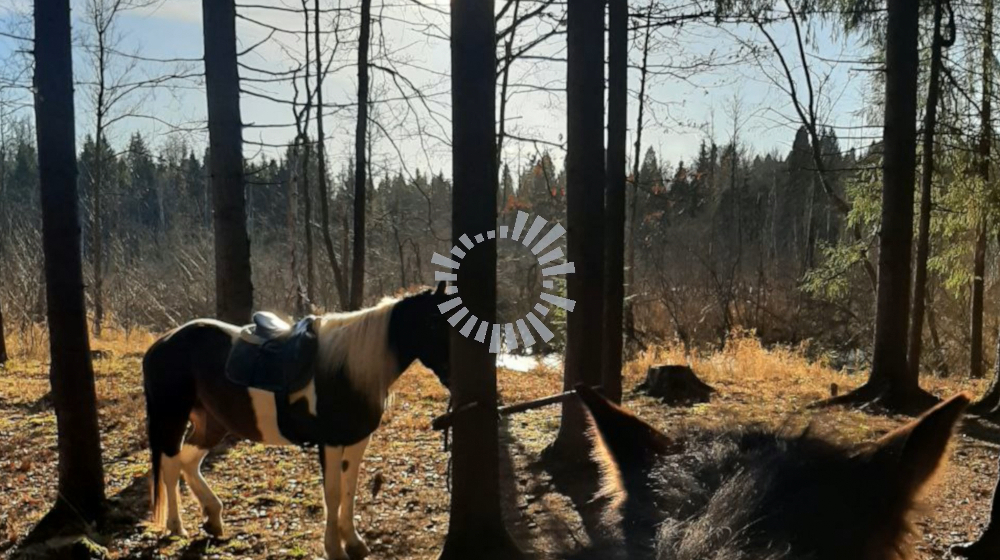

# nodejs-audio-visualizer
Audio visualizer generator for Node.js with simple configuration.  
Supports PNG, JPG for images, MP4/MOV/AVI/MKV for background videos, and MP3, WAV for audio.

## Example
```javascript
const renderAudioVisualizer = require('nodejs-audio-visualizer').renderAudioVisualizer;
const config = {
  image: { // Optional.
    path: 'media/background.png' // Supports PNG and JPG images. Use either 'image' or 'video', not both.
  },
  // OR use a video as background (optional):
  // video: {
  //   path: 'media/background.mp4', // Supports MP4, MOV, AVI, MKV. Loops automatically if shorter than audio.
  //   autoEdit: true, // Optional. Detects scene cuts and advances between them on stronger beats about every 2–4 beats (from detected BPM) so the background edits with the music; omit or false for one continuous play-through from the start. When enabled, a brief camera shake on each beat decays over about one-third of a beat.
  // },
  audio: {
    path: 'media/audio.wav', // Supports MP3 and WAV audio
    autoHighlight: true,
    autoHighlightCount: 3, // Optional. With autoHighlight: how many non-overlapping 15s windows with the highest summed spectral energy to aim for (default 1; must be a whole number ≥ 1). You may get fewer videos if the track is too short or does not have that many valid windows. More than one window produces separate videos next to outVideo.path (e.g. out-1.mp4, out-2.mp4).
  },
  outVideo: {
    path: 'media/out.mp4',
    subtitles: { // Optional.
      path: 'media/subtitles.lrc', // Optional. .srt or .lrc format.
      rawContent: "1\n00:00:00,000 --> 99:59:59,999\nSome Artist - Some Song", // Only if path not specified.
      alignment: "middle", // Optional. Available values: 'top', 'middle', 'bottom'. Default: 'bottom'.
    },
    fps: 25, // Default value: 30
    resolution: { width: 1920, height: 1080 }, // Optional. Output frame size in pixels. Omit to keep the background image or video at its native resolution; when set, video frames are scaled to this size and images are resized (center-cropped first if landscape/portrait does not match the target aspect).
    spectrum: { // Audio spectrum configuration (linear bar visualizer). Optional. If neither 'spectrum' nor 'polar' is specified, no visualizer is drawn.
      width: '30%', // 30% of background image width. Default value: 33%. Also you can use absolute values. For example, value 300 for 300 pixels width.
      height: '15%', // 15% of background image height. Default value: 160. Also you can use absolute values. For example, value 300 for 300 pixels height.
      x: 'center', // Available values: 'left', 'center', right'. Also you can use absolute number values. For example, value 300 for 300 pixels x.
      y: 'bottom', // Available values: 'top', 'middle', bottom'. Also you can use absolute number values. For example, value 300 for 300 pixels y.
      rotation: 'mirror', // Available values: 'up', 'down', 'mirror'. Default value: 'mirror'.
      effect: 'volume', // Available values: 'volume', 'smooth', undefined. Default value: undefined.
      color: '#cccc99', // Default value: inverted color of background image
      opacity: '70%' // Default value: '80%'.
    },
    polar: { // Polar/circular audio spectrum configuration. Optional. Use either 'spectrum' or 'polar', not both.
      x: 'center', // Available values: 'left', 'center', 'right'. Also you can use absolute number values. Default value: 'center'.
      y: 'middle', // Available values: 'top', 'middle', 'bottom'. Also you can use absolute number values. Default value: 'middle'.
      innerRadius: 100, // Inner radius of the circular spectrum in pixels. Default value: 100.
      maxBarLength: 160, // Maximum bar length in pixels. Default value: 160.
      barWidth: 15, // Width of each bar in pixels. Default value: 15.
      effect: 'volume', // Available values: 'volume', 'smooth', undefined. Default value: undefined.
      color: '#cccc99', // Default value: inverted color of background image
      opacity: '70%' // Default value: '80%'.
    }
  },
  tweaks: { // Optional
    ffmpeg_cfr: '30', // Default value: 23
    ffmpeg_preset: 'ultrafast', // Default value: medium
    frame_processing_delay: 1000, // Delay between processing frames in milliseconds
    timeouts: { // Optional. FFmpeg I/O timeouts in milliseconds
      readVideoFrame: 30000, // Max wait for one background video frame from ffmpeg. Default: 30000
      waitDrain: 120000, // Max wait for ffmpeg stdin to accept more frames. Default: 120000
      waitForProcessExit: 480000 // Max wait for ffmpeg to finish after all frames are sent. Default: 480000
    }
  }
};

const onProgress = (progressPercent: number) => { // not necessary callback
  console.log(`progress: ${progressPercent} %`);
};

const shouldStop = () => { // not necessary callback
  return false;
};

renderAudioVisualizer(config, onProgress, shouldStop)
  .then(({ exitCode, outputVideoFiles }) => {
    console.log(`exited with code: ${exitCode}`);
    console.log(`written:`, outputVideoFiles);
  });
```

## Output preview

